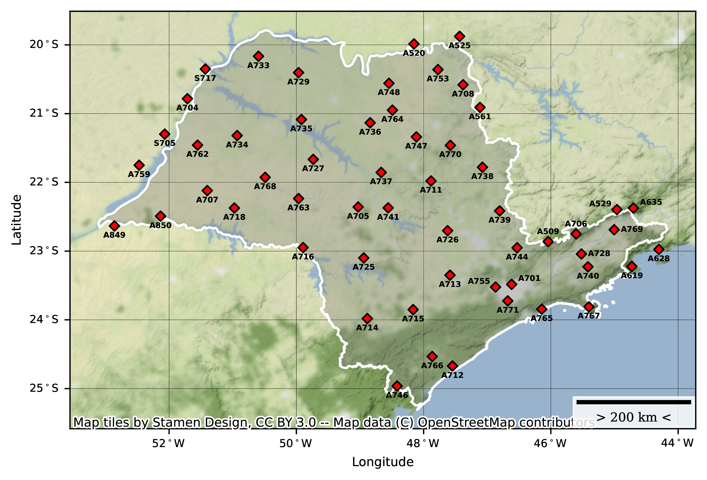
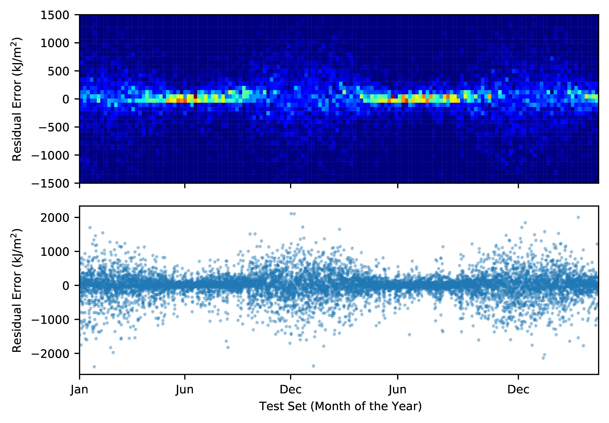
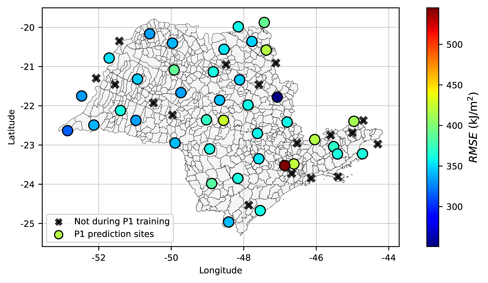
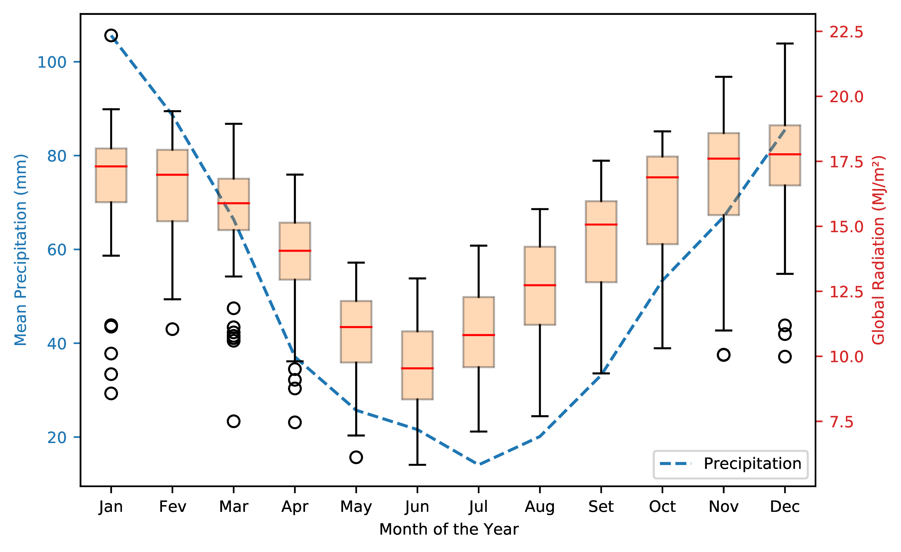
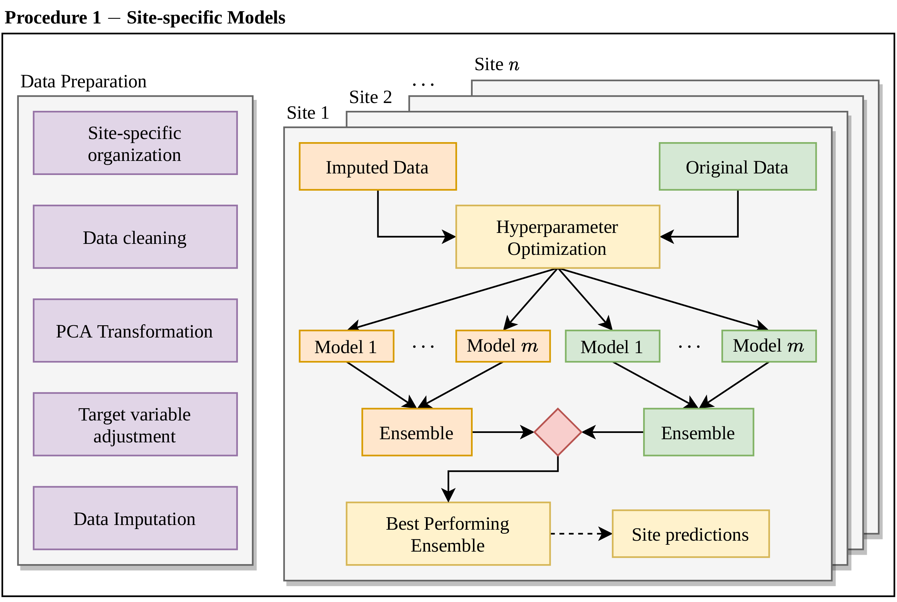
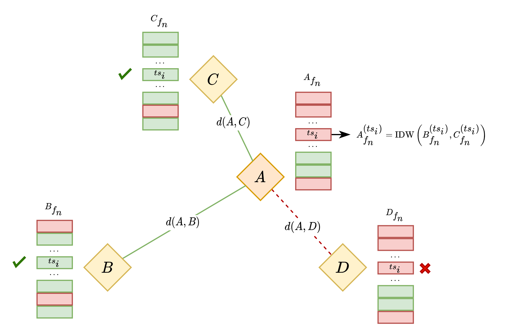
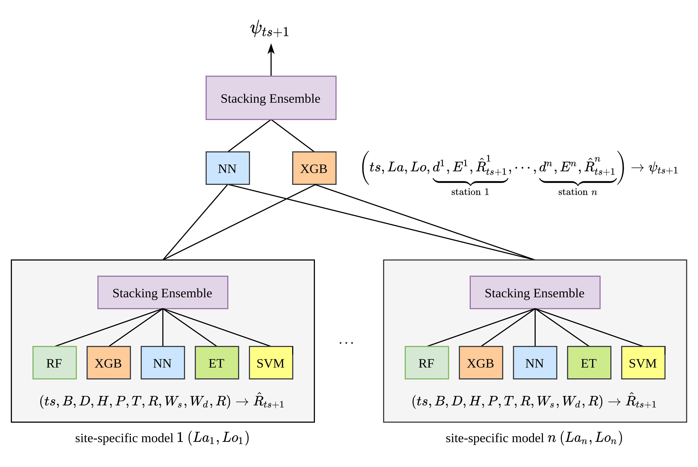

## Multi-ensemble Machine Learning based approach for Short-term Solar Radiation Forecasting

This repository contains the implementation of the scientific project *Multi-ensemble Machine Learning based approach for Short-term Solar Radiation Forecasting*.

The objective of this project was to employ Machine Leaning techniques in order to obtain models capable of forecasting solar radiation 60 minutes in the future from meteorological records such as temperature, humidity, precipitation, etc, obtained in meteorological stations in the State of São Paulo, Brazil. The top-left image below depicts the data collection sites in the area of study.

<table>
    <tr>
        <td></td>
        <td></td>
    </tr>
    <tr>
        <td></td>
        <td></td>
    </tr>
</table>

The proposed objective was divided in 2 procedures:

- Obtain site-specific models trained and tuned with historical meteorological data collected in each one of the collection sites in the area of study. Predictions are site-specific to each collection sites.

- Obtain a single generalization model trained and tuned with the predictions of the site-specific models in the previous procedure. Predictions correspond to generalizations in the geographical space of predictions generated by models obtained in the first procedure. For this procedure a new dataset would have to be constructed from the local predictions in order to train the generalization model

<table>
    <tr>
        <td></td>
        <td></td>
    </tr>
</table>

In order to assess the predictions produced by the generalization model a variation of Inverse Distance Weighting was introduced taking into account not only the distance from the reference prediction sites the predicted site but also the errors of the estimators which produced the predictions to be interpolated. The predictions of both site-specific models and the generalization model were also compared to the CPRG hourly radiation prediction empirical model in terms of performance of the predictions.

## Approach

The data collected are preprocessed on a per station configuration. Among the employed procedures this preprocessing pipeline features the automated download of all data used during training of the models and an imputation method to artificially reconstruct part of the missing data in the obtained datasets.

The data pipeline is composed of the following procedures:

1. Automated data Download and Extraction, performed by [`data/file_downloader.py`](https://github.com/lfenzo/ml-solar-sao-paulo/blob/master/src/data/file_downloader.py)
1. Selection of the files relative to the area of study, performed by [`data/file_filter.py`](https://github.com/lfenzo/ml-solar-sao-paulo/blob/master/src/data/file_filter.py)
1. Concatenation header information processing of the selected files, performed by [`data/file_concatenator.py`](https://github.com/lfenzo/ml-solar-sao-paulo/blob/master/src/data/file_concatenator.py)
1. Filtering, cleaning and standardization of the data for every data collection site, performed by [`data/preprocessing.py`](https://github.com/lfenzo/ml-solar-sao-paulo/blob/master/src/data/preprocessing.py)

The executions of the script mentioned above are scheduled by the script [`data_pipeline.py`](https://github.com/lfenzo/ml-solar-sao-paulo/blob/master/src/data/data_pipeline.py) which stores the resulting set of datasets in the appropriate directory inside `mixer/` considering the presence or absence of the `idw` execution flag.

All the script mentioned above accept arguments from the command-line, for further information use:

```
python <script.py> --help
```

### Data Imputation

The imputation was performed for every feature in every station using Inverse Distance Weighting. For an imputed station A, a set of nearby stations (B, C and D) is obtained and for every timestamp in A available values in B, C and D are interpolated in order to artificially reconstruct the missing values of A.



This process was conducted adopting a minimum of 3 valid values to interpolate, selecting nearby stations within a maximum distance of 120Km.

### Model Training and Tuning

The Machine Learning algorithms used to train the estimators are shown below. For each one of the training algorithms hyperparameters search routines were conducted in order to obtain the best models from the selected hyperparameter search space in each algorithm.

1. [Multi-layer Perceptron (Dense Neural Network)](https://scikit-learn.org/stable/modules/generated/sklearn.neural_network.MLPRegressor.html)
1. [Support Vector Machine ](https://scikit-learn.org/stable/modules/generated/sklearn.svm.SVR.html)
1. [Extremely Randomized Trees (Extra Trees)](https://scikit-learn.org/stable/modules/generated/sklearn.ensemble.ExtraTreesRegressor.html)
1. [Extreme Gradient Boosting](https://xgboost.readthedocs.io/en/latest/python/python_api.html?highlight=xgbregressor#xgboost.XGBRegressor)
1. [Random Forests](https://scikit-learn.org/stable/modules/generated/sklearn.ensemble.RandomForestRegressor.html)
1. [Stacking Regressor](https://scikit-learn.org/stable/modules/generated/sklearn.ensemble.StackingRegressor.html)

The training pipeline was designed to be fully automated and fault-tolerant: in case of the interruption of the training process by any reason, the next run of the script [`training_pipeline.py`](https://github.com/lfenzo/ml-solar-sao-paulo/blob/master/src/training_pipeline.py) is able to detect the last fitted estimator and restart the training process where is was stopped.
Once all the training and tuning processes are complete, the generalized prediction in a given site is schematically depicted below:



In the above image, 𝜓(*ts* + 1) corresponds to the generalized prediction in relation to a timestamp *ts*. The two equations shown in the picture correspond to two input format for the generalization model and the site-specific models.

## Organization and Structure

The content of this repository in `src/` is organized as follows

| Directory/File | Description |
| -------------- | ----------- |
| [`data/`](https://github.com/lfenzo/ml-solar-sao-paulo/tree/master/src/data) | Directory containing all data preprocessing for the site-specific models. Its procedures range from automated download and extraction routines site-specific data filtering and normalization.|
| [`composition/`](https://github.com/lfenzo/ml-solar-sao-paulo/tree/master/src/composition) | Directory containing the definition and implementation of the ML-based generalization model. |
| [`params_grids/`](https://github.com/lfenzo/ml-solar-sao-paulo/blob/master/src/param_grids/gen_param_grid.py) | Directory containing the hyperparameter search grids stored in `.pkl` as well as the script to generate them.|
| [`empirical_vs_ml/`](https://github.com/lfenzo/ml-solar-sao-paulo/tree/master/src/empirical_vs_ml) | Directory containing implementation of the CRPG empirical model as well as its predictions and comparisons with the predictions performed by the site-specific models and the generalization model.|
| [`mixer/`](https://github.com/lfenzo/ml-solar-sao-paulo/tree/master/src/mixer) | In the context of the data imputation, the `mixer/` directory contains scripts the select the best estimators based on the data used during their training *i.e.* the estimators training with original and imputed data are compared and the best estimators are selected. This allows not only the imputation assessment but also provides the best performance when possible from the data.|
| `merged_stations/` | Directory containing all training sites separated by station each one with the respective datasets for training, testing as well as the fitted estimators and their predictions, scaler and transformer objects (*e.g.* PCA transformers). Only created at the moment of execution of `mixer/blend_all.py`.|
| [`visuals/`](https://github.com/lfenzo/ml-solar-sao-paulo/tree/master/src/visuals) | Directory containing script for data visualization regarding the performance reports of the produced estimators. Images such as scatter plots, maps and boxplots are produced from the information gathered from the performance evaluation scripts. |
| [`training_pipeline.py`](https://github.com/lfenzo/ml-solar-sao-paulo/blob/master/src/training_pipeline.py) | Automates the process of training, tuning and performance evaluation. This script is responsible for running `scikit_gym.py`, `performance_metrics.py` and `consolidate_results` with the appropriate CLI arguments. |
| [`scikit_gym.py`](https://github.com/lfenzo/ml-solar-sao-paulo/blob/master/src/scikit_gym.py) | Automates routines to train and tune all estimators in each one of the data collection sites.  |
| [`performance_metrics.py`](https://github.com/lfenzo/ml-solar-sao-paulo/blob/master/src/performance_metrics.py) | Automates performance evaluation for all the models fitted in each one of the training sites. For every prediction site a small performance report is produced and used as input in other scripts.
| [`consolidate_results.py`](https://github.com/lfenzo/ml-solar-sao-paulo/blob/master/src/consolidate_results.py) | Evaluates the performance of the best models using as input the site-specific performance report files produced by `performance_metrics.py`.|
| [`idw.py`](https://github.com/lfenzo/ml-solar-sao-paulo/blob/master/src/idw.py) | Contains the definition and implementation of the Inverse Distance Weighting interpolation used in both data imputing (in the data preprocessing pipeline) and the IDW-variant generalization model.|
| [`tf_gym.py`](https://github.com/lfenzo/ml-solar-sao-paulo/blob/master/src/tf_gym.py) | Deprecated code. It was used when the Keras/Tensorflow framework was considered for the project, however it is no longer functional and should not be executed.|
| [`wakeup.py`](https://github.com/lfenzo/ml-solar-sao-paulo/blob/master/src/wakeup.py) | Deprecated code. It was used when the Dask distributed framework was considered for the project, however it is no longer functional and should not be executed.|

## Dependencies

This project was developed with Python 3 (ver 3.8) relying on the following packages:

- [Pandas](https://pandas.pydata.org/)
- [Numpy](https://numpy.org/)
- [GeoPandas](https://geopandas.org/en/stable/)
- [Scikit-Learn](https://scikit-learn.org/stable/index.html)
- [Joblib](https://joblib.readthedocs.io/en/latest/)
- [Haversine](https://pypi.org/project/haversine/)
- [xgboost](https://xgboost.ai/)

Note that two environment files are provided in the repository for quick setup with Conda: 

- `training_env.yml`:  with packages for used in training processes (used in virtually all scripts except the ones in `visuals/`).
- `plotting_env.yml`: with packages used mostly in plotting scripts. The biggest caveat is GeoPandas which has odd (and possibly breaking) dependencies when it is installed in the same environment as the training packages. Used only in `visuals/`.

In order to install the virtual from the `.yml` files run:

```
conda env create -f <file>.yml
```
